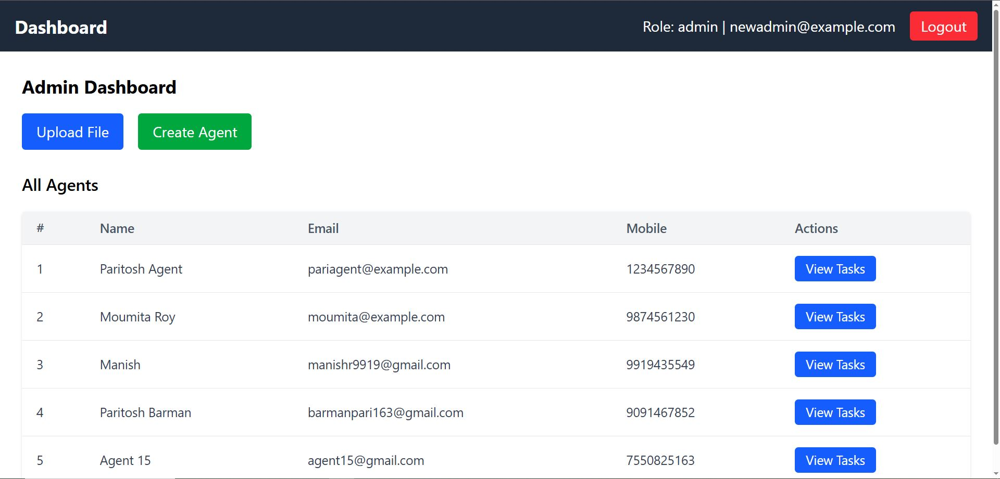

# Auto Task Distribution to Agent App

Live App: [auto-task-distribution-to-agent-app.netlify.app](https://auto-task-distribution-to-agent-app.netlify.app/)  
GitHub Repository: [github.com/ParitoshBarman/Auto-Task-Distribution-to-Agent-App](https://github.com/ParitoshBarman/Auto-Task-Distribution-to-Agent-App)


## 🎥 Demo Video

Watch the full working demo of the project here:  
🔗 [Click to watch on Google Drive](https://drive.google.com/file/d/111STFrt97-xM-OrGTv1sKv-R8lWl0tQg/view?usp=drivesdk)


---
### Test Credentials

#### 🔑 Admin Login
- **Email/Username**: `newadmin@example.com`
- **Password**: `admin123`

#### 🧑‍💼 Agent Login
- **Email/Username**: `pariagent@example.com`
- **Password**: `123`

---

## 🧠 Objective  

Develop a powerful and scalable **MERN stack application** that streamlines agent management and automates task distribution.  
The system ensures:  
- **Seamless Admin & Agent Management** with secure authentication.  
- **Automated Task Allocation** from uploaded CSV files, distributed fairly among agents.  
- **Real-time Task Monitoring** for both admins and agents.  
- **Scalable & Efficient Workflow**, reducing manual effort and improving productivity.  

---
## ✨ Features

### 1. Secure Admin Login
- 🔐 JWT-based authentication.
- Login with **Email & Password**.
- Seamless redirect to **Admin Dashboard** on success.

### 2. Agent Management
- 👤 Admin can **create and manage Agents**.
- Agent details include: **Name, Email, Mobile (with Country Code), Password**.
- 📋 View and manage all registered agents.

### 3. Sub-Agent Management (by Agents)
- 🧑‍🤝‍🧑 Agents can **create their own Sub-Agents**.
- Sub-Agent details include: **Name, Email, Mobile Number, Password**.
- 🔒 **Restriction:** Sub-Agents are fully managed by their parent Agent (no cross-edit or delete access).
- Agents cannot edit/delete other Agents’ Sub-Agents.

### 4. Task Upload & Distribution
- 📂 Upload task files in **CSV, XLSX, or XLS** formats.
- ✅ Built-in **file validation** (only supported formats allowed).
- 📊 Tasks are **distributed equally** among all Agents.
- ⚡ Remaining tasks are assigned **sequentially** for fairness.

### 5. Task Viewing & Monitoring
- 👨‍💼 Admin can **view all tasks** assigned to any Agent in a modal view.
- 📌 Shows **total task count** per Agent.
- 👨‍👩‍👦 Agents can also view tasks assigned to them and their Sub-Agents.

### 6. User-Friendly Dashboard
- 📈 Clean and professional UI with **real-time task insights**.
- 🔎 Quick navigation for Admin, Agents, and Sub-Agents.
- 🚀 Optimized for smooth performance and scalability.

---

## 🛠️ Tech Stack

- **Frontend**: React.js, Tailwind CSS
- **Backend**: Node.js, Express.js
- **Database**: MongoDB
- **Authentication**: JWT, bcrypt

---

## 📂 Folder Structure

```Auto-Task-Distribution-to-Agent-App
├── README.md
├── backend
│   ├── config
│   │   └── db.js
│   ├── controllers
│   │   ├── agentController.js
│   │   ├── authController.js
│   │   ├── csvController.js
│   │   └── taskController.js
│   ├── index.js
│   ├── middleware
│   │   ├── authMiddleware.js
│   │   └── uploadMiddleware.js
│   ├── models
│   │   ├── Agent.js
│   │   ├── Task.js
│   │   └── User.js
│   ├── package-lock.json
│   ├── package.json
│   ├── routes
│   │   ├── agentRoutes.js
│   │   ├── authRoutes.js
│   │   ├── csvRoutes.js
│   │   └── taskRoutes.js
│   └── uploads
│       ├── 1755575720975-sample_contacts.csv
│       └── test.txt
├── frontend
│   ├── README.md
│   ├── eslint.config.js
│   ├── index.html
│   ├── package-lock.json
│   ├── package.json
│   ├── public
│   │   ├── _redirects
│   │   └── vite.svg
│   ├── src
│   │   ├── App.css
│   │   ├── App.jsx
│   │   ├── api
│   │   │   └── axiosInstance.js
│   │   ├── assets
│   │   │   └── react.svg
│   │   ├── components
│   │   │   ├── AllRoutes.jsx
│   │   │   ├── AuthFormInput.jsx
│   │   │   ├── Navbar.jsx
│   │   │   └── PrivateRoute.jsx
│   │   ├── index.css
│   │   ├── main.jsx
│   │   ├── pages
│   │   │   ├── AdminDashboard.jsx
│   │   │   ├── AgentDashboard.jsx
│   │   │   ├── Create.jsx
│   │   │   ├── Login.jsx
│   │   │   ├── Register.jsx
│   │   │   └── UploadFile.jsx
│   │   └── redux
│   │       ├── authSlice.js
│   │       ├── store.js
│   │       └── userSlice.js
│   └── vite.config.js

---

## 🧪 How to Run Locally

### Backend Setup

```bash
git clone https://github.com/ParitoshBarman/Auto-Task-Distribution-to-Agent-App.git
cd Auto-Task-Distribution-to-Agent-App/backend
npm install
```
Create a `.env` file in the `backend` directory:

```
PORT=5000
MONGO_URI=your_mongodb_connection_string
JWT_SECRET=your_secret
```

```bash
npm run dev
```

### Frontend Setup

```bash
cd ../frontend
npm install
npm run dev
```

Visit: `http://localhost:5173`

---

### 🔧 Environment Setup

> **Note:** Make sure to create the `.env` files in both `frontend` and `backend` directories.

#### ✅ For Frontend (`frontend/.env`)
```env
VITE_API_BASE_URL=http://localhost:5000/api
VITE_BASE_URL=http://localhost:5000
```

#### ✅ For Backend (`backend/.env`)
```env
PORT=5000
MONGO_URI=mongodb://localhost:27017/admin-agent-app
JWT_SECRET=yourSecretKey
```

> Replace `yourSecretKey` with a strong secret of your choice.

---

## 🚀 Routes Overview

### 🔹 Frontend Routes (React Router)
- `/` → Redirects to **/dashboard** if logged in, otherwise **Login**
- `/login` → User Login page
- `/register` → User Registration page
- `/upload` → Upload CSV file (protected: Admin/Agent only)
- `/create` → Create Agent / Sub-Agent (protected)
- `/dashboard` → 
  - **Admin** → AdminDashboard  
  - **Agent** → AgentDashboard  
- `/*` → Custom 404 Page (for invalid routes)

---

### 🔹 Backend API Routes (Express.js)

#### Auth Routes (`/api/auth`)
- `POST /login` → Login user
- `POST /register` → Register new user

#### Agent Routes (`/api/agents`)
- `POST /create` → Create new Agent or Sub-Agent (Admin/Agent only)
- `GET /` → Get all Agents (Admin) or own sub-agents (Agent)
- `PUT /:id` → Update Agent details
- `DELETE /:id` → Delete Agent

#### CSV Routes (`/api/csv`)
- `POST /upload` → Upload CSV file (Admin/Agent only)
- `GET /agent/:id` → Get tasks assigned to specific agent

#### Task Routes (`/api/tasks`)
- `GET /my` → Get tasks for logged-in user (Admin/Agent)
- `GET /:agentId` → Get tasks assigned to a specific agent
- `PUT /:taskId` → Update a task
- `DELETE /:taskId` → Delete a task

#### Root Route
- `GET /` → Welcome message: *"Welcome to Auto Task Distribution to Agent App by Paritosh Barman"*

---
## 📸 Screenshots

| Screenshot Name                          | Preview                                                                 |
|------------------------------------------|-------------------------------------------------------------------------|
| Admin Dashboard                          |                    |
| Agent Create Modal Form                  |  |
| Agent Dashboard                          |                  |
| Create Sub-Agent by Agent |  |
| Agent Mobile View                        |           |
| File and Agent Creation Button           |  |
| File Upload                              |                          |
| List of Tasks Assigned to the Agent      |  |
| Responsive Navbar (Closed)               |  |
| Responsive Navbar (Expanded)             |  |
| View Tasks Button                        |            |


---

## 📦 Deliverables

- ✅ All required features completed.
- ✅ Clean and readable code.
- ✅ Live Deployment.
- ✅ Demo video included.
- ✅ Complete `.env` configuration sample provided.


---

**Made with ❤️ by Paritosh Barman**